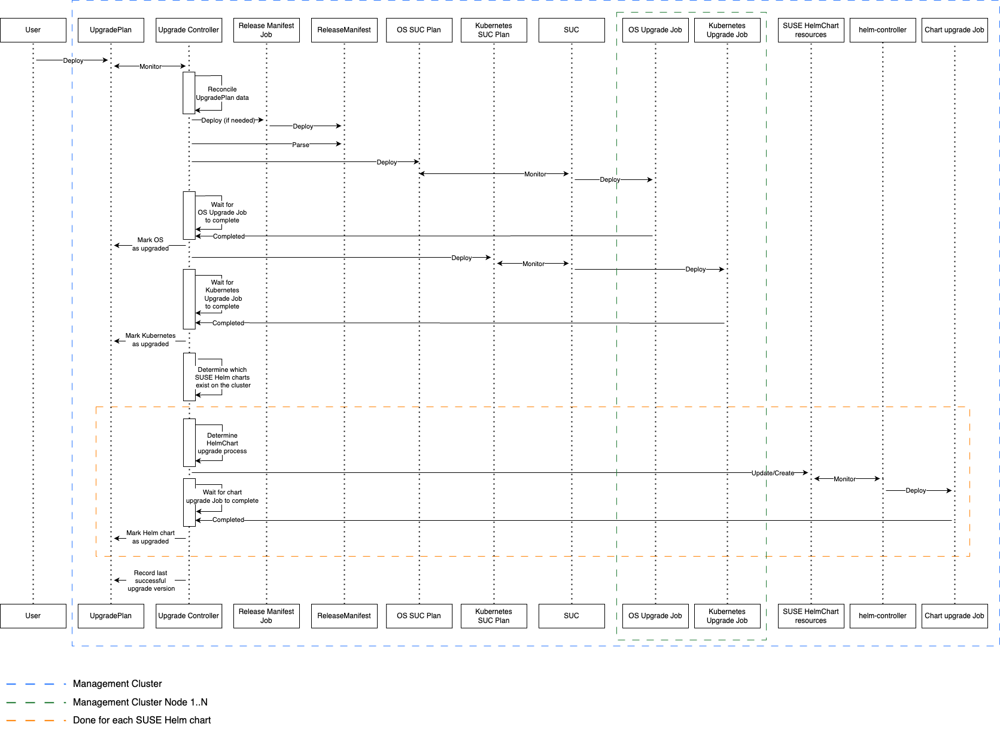

# Development guide

## Workflow

The [README](../README.md#workflow) briefly touches on how the upgrades are executed.

Use the following diagram to familiarize yourself with the internals around the process.


## Prerequisites
- Go version v1.22.0+
- Docker version 17.03+.
- kubectl version v1.28+.
- Access to a Kubernetes v1.30+ cluster.

## How to deploy?

**Build and push your image to the location specified by `IMG`:**

```sh
make docker-build docker-push IMG=<some-registry>/upgrade-controller:tag
```

**NOTE:** This image ought to be published in the personal registry you specified.
And it is required to have access to pull the image from the working environment.
Make sure you have the proper permission to the registry if the above commands don’t work.

**Install the CRDs into the cluster:**

```sh
make install
```

**Deploy the controller to the cluster with the image specified by `IMG`:**

```sh
make deploy IMG=<some-registry>/upgrade-controller:tag
```

> **NOTE**: If you encounter RBAC errors, you may need to grant yourself cluster-admin
privileges or be logged in as admin.

## How to test?

Use the custom resource examples from the `config/samples` dir in order to trigger the reconciliation:

```sh
kubectl apply -k config/samples/
```

>**NOTE**: Ensure that the samples have the expected values you'd want to test with.

## How to uninstall?

**Delete the instances (CRs) from the cluster:**

```sh
kubectl delete -k config/samples/
```

**Delete the APIs (CRDs) from the cluster:**

```sh
make uninstall
```

**Undeploy the controller from the cluster:**

```sh
make undeploy
```